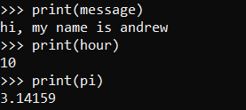
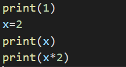

# _Variables, expressions, and statements_
+ #### Values and types  
A value is one of the basic things a program works with, like a letter or a number.  
Examples of values are 1, 3.14, and "Hello, World!"

These values belong to different types: **1** is an integer, **3.14** is an float, and **"Hello, World!"** is a string.

**Float&nbsp;&nbsp;&nbsp;&nbsp;:** Numbers which are represented in a format called floating point.  
**String&nbsp;&nbsp;&nbsp;:** Value which contain "string" of leters and enclosed in quotation marks.

**type** Statement can specify type of value  


>**Note:** any value enclosed in quotation mark is considered as string

***

## 1._Variables_
A variable is a name that refers to a value.

An assignment statement creates new variables and gives them values:  
  
This example makes three assignments. The first assigns a string to a new variable named **message**.  
the second assigns the integer 10 to **hour**. the third assigns the (approximate) value of π to **pi**.  

To display the value of a variable, you can use a print statement:  


The type of a variable is the type of the value it refers to:  


<br>

+ ### Variable names and keyword
Variable names can be arbitrarily long. They can contain both **letters** and **numbers**,  
but they cannot start with a number. It is legal to use uppercase letters,  
but it is a good idea to begin variable names with a lowercase letter.

The **underscore** character (_) can appear in a name. It is often used in names with multiple words,  
such as **my_name** or **time_at_start**. Variable names can start with an underscore character

If you give a variable an illegal name, you get a syntax error:  


Also some names are not allowed to use as variable names They are called **Keywords** The interpreter  
uses keywords to recognize the structure of the program, and they cannot be used as variable names.

>#### Python reserves 33 keywords:
>**and**&emsp;**del**&emsp;**from**&emsp;**None**&emsp;**True**&emsp;**as**&emsp;**elif**&emsp;**global**&emsp;**nonlocal**&emsp;**try**&emsp;**assert**  
>**else**&emsp;**if**&emsp;**not**&emsp;**while**&emsp;**break**&emsp;**except**&emsp;**import**&emsp;**or**&emsp;**with**&emsp;**class**&emsp;**False**  
>**in**&emsp;**pass**&emsp;**yield**&emsp;**continue**&emsp;**finally**&emsp;**is**&emsp;**raise**&emsp;**def**&emsp;**for**&emsp;**lambda**&emsp;**return**
  
***


## 2. _Statements_  
A statement is a unit of code that the Python interpreter can execute

When you type a statement in interactive mode, the interpreter executes it and displays the result,  
if there is one.  


A script usually contains a sequence of statements. If there is more than one statement,  
the results appear one at a time as the statements execute.  
For example, the script:  


Produces the output:  


>**Note:** Assignment statement produces no output

## 3. _Operators and operands_
Operators are special symbols that represent computations like addition and multiplication.  
The values the operator is applied to are called operands.  
Operator|operation|example
--------|---------|-------
`+`|Addition|```20+3```
`-`|Subtraction|```hour-1```
`*`|Multiplication|```hour*60```
`/`|Divition|```minite/60```
`**`|Exponentiation|```2**5```

> Note:There has been a change in the division operator between Python 2.x and Python 3.x. In Python 3.x, the result of this division is a floating point result:
>```python
> >>> minute = 59
> >>> minute/60
> 0.9833333333333333
>```
> The division operator in Python 2.0 would divide two integers and truncate the
result to an integer:
>```python
> >>> minute = 59
> >>> minute/60
> 0
>```
> To obtain the same answer in Python 3.0 use floored ( // integer) division.
>```python
> >>> minute = 59
> >>> minute//60
> 0
>```

